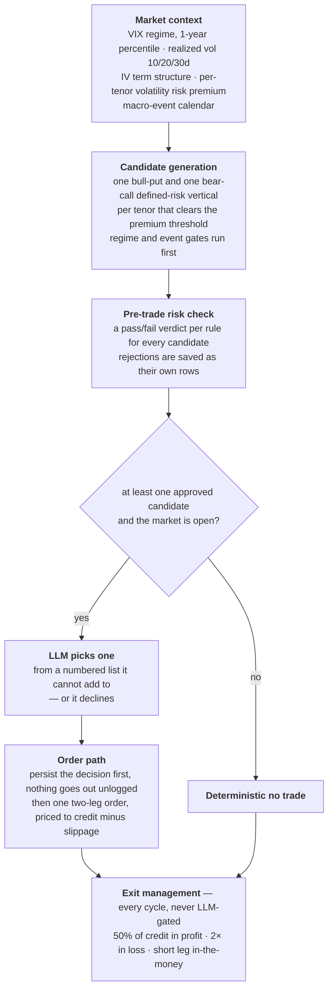
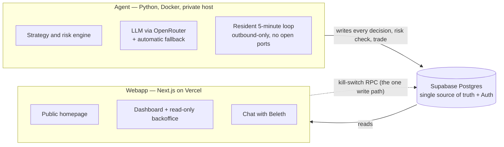

<p align="center">
  
</p>

<h1 align="center">Beleth Agent</h1>

<p align="center">
  <em>Power under strict rules. A trading agent that sells volatility for a living —<br>
  and shows you every bet it makes, and every bet it refuses.</em>
</p>

<p align="center">
  <a href="https://beleth-agent.vercel.app"><strong>Live dashboard →</strong></a>
</p>

---

Autonomous AI options-trading agent built for the [Alpaca AI Trading Agents Hackathon](https://lablab.ai)
(lablab.ai, Aug 28 – Sep 4, 2026). Trades exclusively on a dedicated Alpaca **paper trading**
account and includes options trading, themed around volatility, hedging, and portfolio overlays.

Character: **profitable, conservative, cautious.** Beleth is not built to maximize return at
any cost — it's built to show that a disciplined, transparent, risk-bounded system can still
be profitable. Every trade decision (and every risk-check rejection) is logged and surfaced,
not just the wins.

## What you're looking at

A demon king of the Ars Goetia, reimagined as a portfolio manager on a very short leash.
Beleth wakes every five minutes the market is open, reads the state of volatility, decides
whether there's a bet worth making, and — if there is — places exactly one defined-risk
spread. Then it does the thing most trading bots never do: it writes down *why*, in plain
language, where anyone can read it.

Open the [live dashboard](https://beleth-agent.vercel.app). The latest decision is right
there on the homepage — including the days it looked at the market and decided the honest
move was to sit on its hands.

## The edge it trades

Implied volatility — what the options market charges for uncertainty — runs persistently
higher than the volatility that actually shows up. That gap is the **volatility risk
premium**, and it's one of the most durable edges in options: on the S&P 500 it's been
positive in roughly three months out of four for decades.

It is not free money. It's payment for carrying crash risk, and it pays in small steady
wins punctuated by sharp losses. So Beleth doesn't just harvest it blindly — it **measures**
the premium on offer before every trade, across a ladder of expiries (7 / 14 / 21 / 30 / 45
days), and only sells the tenor where the premium is actually worth the risk. If no expiry
clears the bar, there's no trade, and the dashboard says so.

Every claim behind the strategy — sorted by how much it can be trusted, from peer-reviewed
research down to our own judgement calls, with a source on each one — is laid out in
[`docs/strategy.md`](docs/strategy.md). That same file is fed verbatim into the language
model's prompt, so the agent reasons from exactly what you can read.

## How Beleth thinks

One cycle, per symbol (SPY and QQQ), every five minutes the market is open:



The language model is on a leash by design. It chooses *which* pre-approved spread to trade —
nothing more. It never sees a rejected candidate, never sets a size, never touches the risk
math. If it fails, times out, or returns nonsense, the cycle falls back to "no trade." An LLM
can talk Beleth out of a trade. It can never talk it into a bad one.

## The rules it cannot break

Strategy parameters live in [`config/strategy.yaml`](config/strategy.yaml), never in code.

| Rule | What it enforces |
|---|---|
| **R1** | No entry unless the measured premium on the candidate tenor clears the threshold. |
| **R2** | An inverted IV term structure (stress signal) blocks all new short-premium positions. |
| **R3** | No position whose expiry crosses a known macro event within N days. |
| **R4** | Defined risk only. Max loss is computed, logged, and shown *before* the order goes out. |
| **R5** | Exits — 50% of credit in profit; 2× credit in loss, or short leg in-the-money. Mechanical. |
| **R6** | Sizing — 1–2% risk per trade, at most five positions open at once. |
| **R7** | Daily stop — intraday drawdown past 3% halts new entries for the rest of the day. |
| **R8** | If nothing clears the bar, do not trade — and state the reason. |
| **R9** | In extreme low-volatility regimes the trade size tapers down; below a floor, it stops. |
| **R10** | A resting order, a naked or unpaired leg, or an unreadable order book blocks new entries. |
| **R11** | Total risk across all open positions plus a new one must stay under a percent-of-equity ceiling. |

Reducing risk is always allowed — exits (R5) are never blocked by the entry gates.

And the constraints that hold for the entire life of the project (the project notes has
the full list):

- **Paper trading only.** There is no live-trading code path. Not behind a flag, not for
  "completeness."
- **No secrets in the repo.** Keys live only in a gitignored `.env`.
- **Every order passes the risk check before it can reach Alpaca.** No exceptions, no bypass.
- **Defined-risk structures only** — one multi-leg vertical spread per position. Never a naked
  leg, never unbounded loss.
- **Every decision is persisted** — inputs, reasoning, outcome, risk-check result.
- **The LLM layer is provider-agnostic.** Swapping model or provider is a config change.
- We never claim the strategy "can't lose." Max loss per trade is known and capped; losing
  trades are a normal part of how this edge pays out.

## Built to be watched

The whole point is that you don't have to take Beleth's word for anything.

Everything the agent does lands in a shared Postgres database, and the webapp reads straight
from it. The public homepage shows agent status, the latest decision in plain language, the
equity curve, and the running tally of risk-check passes and rejections. Sign in and there's
more; the **read-only backoffice** exposes the full decision history, the per-rule risk-check
detail, the raw model reasoning, the evidence package behind every call, and the strategy
config as it stood at that moment.

| Access | What it sees |
|---|---|
| **Anonymous** | The public homepage — status, latest decision, equity curve, pass/fail tally. |
| **Public user** (self-signup) | A curated dashboard, plus **"Chat with Beleth"** — an in-character, strictly read-only conversation with tools over the live data. |
| **Demo admin** (shared account) | The full backoffice, **read-only**: every decision, every rejection, every reasoning trace. |
| **Master admin** (operator only) | The above, plus the kill switch — pause and resume the agent, with an audit log. |

Access states are enforced in the database with row-level security, not just hidden in the UI.

## Architecture

Two independent processes that talk **only** through the database — deliberately not a
monolith. The dashboard stays up and shows the last known state even if the trading host is
switched off; only the production of *new* decisions pauses.



**Agent** — Python 3.11, one Docker service (`restart: unless-stopped`, no exposed ports,
secrets only via runtime env). A resident loop runs one full cycle per symbol every five
minutes while the market is open, and drops to a 15-minute heartbeat outside hours so the
dashboard can tell "alive, market closed" from "agent down." It obeys the master-admin pause
switch fail-closed. LLM calls go through the standard OpenAI SDK pointed at OpenRouter (a free
tool-calling model), with a second free provider as automatic fallback.

**Webapp** — Next.js 16 App Router + Tailwind v4, one Vercel deploy, reading the same database
the agent writes. Four access states via Supabase Auth + row-level security. Exactly one write
path from the webapp: the kill-switch RPC.

**Supabase** — shared Postgres, the single source of truth, plus Auth. The agent writes with a
service-role key; the webapp reads with RLS-aware access. Schema in
[`db/migrations/`](db/migrations/), data dictionary in [`db/README.md`](db/README.md).

## Honest about the numbers

Two things worth knowing before you read any P&L figure:

- Beleth runs on Alpaca's **Basic** data plan. The options feed is *indicative*, not full
  OPRA, and historical data excludes the last 15 minutes. The implied volatility it reasons
  over is less precise than a professional desk's.
- The contest window is about **five market days**. Over a horizon that short, the result is
  mostly luck. We're not going to dress it up as skill.

Both are expanded in [`docs/strategy.md`](docs/strategy.md), notes C2 and C5.

## Under the hood

| | |
|---|---|
| **Agent** | Python 3.11, [`uv`](https://docs.astral.sh/uv/), `alpaca-py`, OpenAI SDK, Docker |
| **Market data** | Alpaca (chain, Greeks/IV, bars), FRED (`VIXCLS`), CBOE (VIX fallback) |
| **LLM** | OpenRouter free model via OpenAI SDK, AI/ML API fallback — both OpenAI-compatible |
| **Persistence** | Supabase Postgres over PostgREST |
| **Webapp** | Next.js 16, Tailwind v4, `@supabase/ssr`, TradingView Lightweight Charts, Vercel |
| **Tests** | 270 unit tests (no network) + a 22-test integration suite against the live paper account, market data, FRED, and Supabase |

## Repository layout

```
.
├── the project notes              # constraints and context for local tooling sessions
├── TODO.md                # milestone-by-milestone build status
├── .env.example           # required environment variables (copy to .env, never commit .env)
├── app/                   # agent package
│   ├── config.py          # settings + config/strategy.yaml loader (hard-enforces paper-only)
│   ├── alpaca_client.py   # paper-only Alpaca client wiring
│   ├── evidence.py        # assembles the evidence package for the decision layer
│   ├── vrp.py             # per-tenor volatility risk premium scan
│   ├── risk_check.py      # R4 / R6 / R7 / R9 / R10 / R11 pre-trade gate
│   ├── decision.py        # deterministic verdict + LLM decision layer
│   ├── orders.py          # sizing, pricing, submission of the one mleg order
│   ├── exits.py           # R5 — pair open legs into spreads, measure against targets
│   ├── market/            # VIX (FRED), realized vol, IV term structure, macro calendar
│   ├── options/           # chain fetch, delta filter, IV rank, spread-candidate builder
│   └── llm/               # OpenAI SDK → OpenRouter client (+ fallback)
├── config/
│   ├── strategy.yaml      # every strategy parameter (never hardcoded)
│   └── macro_events.yaml  # known macro events for the contest window (R3 gate)
├── docs/strategy.md       # strategy reasoning by reliability tier, with sources
├── db/                    # Supabase schema migrations + data dictionary
├── scripts/               # read-only checks, the resident runner, the deploy guard
├── tests/                 # unit tests (fast) + integration (`pytest -m integration`)
├── webapp/                # the Next.js dashboard (see webapp/README.md)
├── Dockerfile / compose.yaml
└── local reference material at               # local-only: vendored Alpaca docs, the project spec, design material (gitignored)
```

## Run it yourself

Requires [`uv`](https://docs.astral.sh/uv/), an Alpaca **paper** account with options level 3,
an OpenRouter key, and a Supabase project.

```bash
cp .env.example .env          # fill in Alpaca paper keys, OpenRouter key, Supabase URL + service-role key
python3 scripts/fetch_docs.py # repopulate the gitignored local Alpaca doc cache
uv sync

# Read-only checks — no orders, no writes unless noted:
uv run python scripts/check_alpaca_connection.py            # paper account + positions
uv run python scripts/check_market_data.py SPY              # full cycle: evidence → risk gate → decision → (order) → persist
uv run python scripts/check_order_path.py --dry-run         # build the order a trade would send; submits nothing
uv run python scripts/check_supabase_connection.py --smoke  # persistence round trip

uv run pytest                    # fast unit tests, no network
uv run pytest -m integration     # hits the real paper account + market data + FRED + Supabase
```

### The resident agent

```bash
python scripts/deploy_guard.py && docker compose up -d --build   # rebuild only when the market is closed
docker compose logs -f beleth-agent                              # live narrative (also mirrored to a logs volume)
docker compose stop beleth-agent                                 # graceful SIGTERM stop
```

- **Never rebuild during market hours** — recreating the container kills the in-flight cycle
  and the resting-order guard's live view. `scripts/deploy_guard.py` refuses while the market
  is open (`--force` overrides for an emergency).
- **Kill switch** — set `agent_status.paused = true` (or use the master-admin dashboard) to
  suspend cycles without stopping the container. The loop polls it every 30 s; the agent never
  writes that column itself.
- **Durable record** — decisions, risk-check outcomes, trades, and the heartbeat live in
  Supabase and survive every container recreation. The on-disk log is a convenience, not the
  source of truth.

### The webapp

See [`webapp/README.md`](webapp/README.md) for local setup and the Vercel deploy checklist.

## Status

In active development for the contest window. [`TODO.md`](TODO.md) tracks progress
milestone by milestone. The agent — strategy, risk gate, LLM decision layer, order path, R5
exits, resident loop, full persistence — is built and running live on the paper account. The
webapp's public homepage, authenticated dashboard, read-only backoffice, master-admin kill
switch, and "Chat with Beleth" are built and deployed.

## License

TBD.
